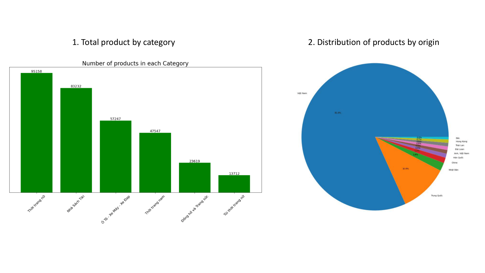

# Source

## 0. Set up
- Install MongoDB & MySQL

## 1. Scrape data
Script: [load_data.py](src/load_data.py)
### Description
Scrape information of all products on the Tiki website
### Workflow
- Send `request` to `Tiki web APIs` to get product information
- Use `time.sleep` to alternate pauses after 50 and 100 requests, avoiding IP blockage.
- Insert scraped data directly to the `product` collection within the `tiki` MongoDB database
- output: [sample_output](data/processed_data/MongoDB_sample_output.json)

## 2. Migrate data from MongoDB to MySQL
Script: [migrate_data.py](src/migrate_data.py)
### Description
Migrate specific data fields from MongoDB to MySQL for further use and analysis
### Workflow
- Create the `product_data` table within the `tiki_product` database
- Set up the metadata for the `product_data` table
- Get these fields from each document in `product` collection and insert into `product_data` table in MySQL: `id`, `name`, `category_id`, `category_name`, `subcategory_id`, `subcategory_name`, `short_description`, `description`, `url`, `price`, `rating`, `quantity_sold`, `origin`
- Use `BeautifulSoup` to remove `html tags` in `description` field before insert into MySQL
- Output: [sample_output](data/processed_data/MySQL_sample_output.csv)
  
## 3. Extract `ingredient` information
Script: [extract_data.py](src/extract_data.py)
### Description
Extract `product_id` and `ingredient` information in the product's `description` for product development team to use
### Workflow
- Find all documents that have the string pattern `thành phần:` and extract ingredient data after `thành phần:`
- Use `BeautifulSoup` to remove `html tags` in `description`
- Output: [sample_output](data/processed_data/ingredient.csv)

## 4. Analyze data
Script: [analyze_data.py](src/analyze_data.py)
### Description
Create visualizations for better understanding of product

